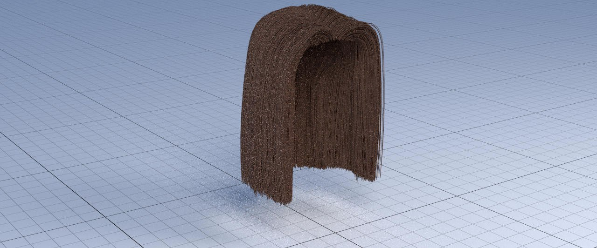

# Hair Shading
- Veronica Birindelli - 1647857
- Gabriel Radu Taranciuc - 1693558

In this project we integrated new functionalities into yocto_pathtrace, implementing a hair scattering model based on the implementation described by Matt Pharr in prbt (https://www.pbrt.org/hair.pdf).
Some details that were omitted in the paper were instead taken from their source code (https://github.com/mmp/pbrt-v3).

## Theory background

To perform all the correct calculations, the paper gives some geometric descriptions of the problem at hand. In particular, it provides tools to measure incident and outgoing directions when a ray intersects a hair on a given point.
The hair is assumed to be a curve, which is the shape obtained when a circle is swept along a Bézier curve, generating a cylinder. 
They consider two different kind of scattering:
- Scattering on the longitudinal plane
		It considers the scattering on the side view of the curve, or more formally the length of the curve. The surface normals at a certain point are given by the surface normals of the circular cross-section at that point. The plane on which they lay is called the normal plane.
- Scattering on the azimuthal plane
		It consider scattering on the curve-width direction.
### Directions at the intersection point
When a ray hits a hair, the directions of the incoming and outgoing rays are measured by two angles, θ and φ.
- θ: is called the longitudinal angle, and measures the offset of a ray w.r.t. the normal plane
- φ; is called the azimuthal angle, and is found by projecting a direction ω into the normal plain, and computing its angle with the y axis

Another useful parameter is the h parameter. It parametrizes the circle's diameter of the hair section. Given a h for a ray that has intersected the curve, the angle γ between the direction ω and  the surface normal can be calculated. Trigonometry tells us that sin γ = h.

### Scattering from hair
The paper assumes the cuticle can be modeled as a rough dielectric cylinder, with scales all angled at the same angle α. The hair interior is treated as a homogeneous medium that only absorbes light. Scattering is assumed to be modeled accurately by a BSDF, assuming the light enters and exits at the same place.
The parameter p measures the number of path segments that light arriving at the hair follows inside the hair before being scattered back out. p=0 means R, p=1 means TT, p=2 means TRT, p=3 means TRRT and so on. 

The hair BSDF (in the code denoted by fsum) will be written as a sum over the p-terms. It will also be divided into terms that depend only on angles θ or φ (the latter is given by φo-φi): Mp(θo,θi), the longitudinal scattering function; Ap(ωo), the attenuation function; and Np(φ), the azimuthal scattering function. 
In the implementation just the first few terms of the sum are calculated explicitly, all the higher-order terms will be represented by a single term. The constant Pmax will control exacty how many therms there will be before switching over. As the paper suggested, we used a Pmax value of 3.

## Implementation

The model implemented is parametrized by 6 values. In our code, they are all saved in a data structure called ``` struct hair{} ```, defined in the file yocto_extention.h. All these values are either hard-coded or calculated in the method ```hair_bsdf()``` in yocto_extention.cpp.
The parameters are the following:

- h: which gives the offset on curve width where the ray intersected the hair, it's defined on the interval [−1, 1]. In our implementation, is calculated in ```hair_bsdf()```.
- eta: which gives the index of refraction of the interior of the hair. It's hard-coded inside the ```hair_bsdf()``` method with the value advised by the paper, which was 1.55. 
- beta_m: the longitudinal roughness of the hair, in the range [0, 1]. It's hard-coded inside the ```hair_bsdf()``` method with various values. We chose 0.125 for high roughness, and 0.05 for low roughness.
- beta_n: the azimuthal roughness, also in the range [0, 1]. It's hard-coded inside the ```hair_bsdf()``` method with the value of 0.4.
- alpha: the angle that hair scales form with the base cylinder, expressed in degrees. We used the value suggested in the paper, which was 2, again, hardcoded inside ```hair_bsdf()```.
- sigma_a: the absorption coefficient of the hair interior. This value is actually computed with the method ```SigmaAFromReflectance()``` that is described in the paper. The method takes a color and the parameter beta_n as inputs, and gives the correct absorption coefficient. It is found in yocto_extension.h

We also implemented the general utility functions described in the paper. In particular, we implemented  ```Sqr()``` that does nothing more than a multiplication of the input by itself and returns the computed value, ```Pow<>()``` a function to efficiently calculate powers using templates, and ```SafeAsin()``` and ```SafeSqrt()``` to comput the sine and the square root even when the numbers are slightly out of range due to round-off errors. All these methods are implemented in yocto_extension.h.

We also implemented the three main functions used to calculate the hair BSDF, namely Mp, Ap and Np. These three methods are found in yocto_extension.cpp

#### LONGITUDINAL SCATTERING: Mp
This function implements the model developed by d'Eon et al. It provides a scattering function that is normalized and can be sampled directly. It is based on various terms, amongst them there is the modified Bessel function of the first kind I0. Since this function is not numerically stable for low roughness values (meaning low v values), for v <= 0.1 the log(I0) is used instead. Both are defined in the ```IO() ``` and ``` LogIO()``` methods in yocto_extension.h

#### ABSORPTION IN FIBERS: Ap
This function calculates how much of the incident light is affected by each of the scattering modes p. It takes into account two effects, the Fresnel reflection and transmission, and the absorption of light - which is what gives hair its color. 
It takes in input a single segment's transmittance T, the longitudinal angle of the outgoing ray θo, and computes the attenuation for the various terms. For the first term with p=0, which corresponds at the light reflected at the cuticle, the Fresnel reflectance is used to give the fraction of light that is reflected. For the second term with p=1, two (1-f) terms must be taken into account, corresponding to the two transmissions in and out the hair boundary, and a single T for one transmission path traversing the inside of the hair. Each term from p=2 up until pMax has one reflection and one tranmission event more than its predecessor. For higher order terms a closed form of the sum of the infinte terms of the series is used. 

#### AZIMUTHAL SCATTERING: Np
This function calculates the component of scattering that is dependent on the angle φ, meaning that it works entirely on the normal plane.
The new azimuthal direction si calculated assuming a perfect specular reflection and transmission, and then defining a distribution of directions around this central direction. Increasing azimuthal roughness βn gives a wider distribution. This can be approximated by a logistic distribution.
A function φ(p, h) computes the net change in this azhimutal direction, given a certain p and h.
The Np function therefore computes the angular difference between φ and φ(p, h), and evaluate the azimuthal distribution with that angle. Since this difference can be outside the range of the logistic function that it is defined on, we rotate this difference around the circle to get the right range. 


Finally, we show how these functions were used to evaluate the hair bsdf. We'll describe two functions, ``` hair_bsdf()``` which sets the parameters that are going to be used in the various computations, and ```eval_hair()``` which evaluates the bsdf parameters.

### hair_bsdf()
At first, this function sets the parameters, initializing the hair data.
It then computes the longitudinal roughness v for the various p terms according to the given parameter βm. Higher values of βm give the hair a more "dry" and "ruined" look and a more diffuse appearence. At low values of βm the hair appears shinier.

It then computes the azimuthal logistic scale factor from βn. For higher values of βn the hair lightens, as more multiply-scattered lights can exit.

It then computes the α terms for hair scales, that are going to be used for adjustments for the θo terms in the ```eval_hair()``` function. The first α term is nothing other then the sine and the cosine of the angle given in input, while the other terms are the preceding value multiplied by 2. 

### eval_hair()
Here we implement the overall evaluation given outgoing and incoming rays, using the formula: 

	(Mp(θo, θi) * Ap(ωo) * Np(φ))/(|cos θi|)

to compute each p term of the evaluation. Here ωo is the outgoing direction given in input. 
The complete evaluation is then given by the sum over all p terms for the above formula. Below is a more step-by-step of the phases before the above computations. 

This function first evaluates the coordinates of the longitudinal angle θ and azimuthal angle φ for both incoming and outgoing ray.
Then it calculates the transmittance angles of the incoming rays, θt and φt, to calculate the distance the ray travels inside the hair before it exits. The angles are used to measure the distances in the azimuthal and longitudinal planes and are going to be used to compute the transmittance T of a single path through the hair. All this coordinates are going to be used to calculate Ap.

It then evaluates the hair BSDF by first calculating the angle θ and then the Ap term. Then it computes sin θo and cos θo taking into account hair scales, making the appropriate rotations, over the various p terms. This is donw using the formula: 

	sin θ ± α = sin θ cos α ± cos θ sin α
	cos θ ± α = cos θ cos α ∓ sin θ sin α

Where the α terms are 2α for p = 0, -α for p = 1, and -4α for p = 2. 

Finally, in fsum, we accumulate what is given in the formula mentioned at the beginning of this section, summing over all p terms. 


### sample_hair()
Samples are genenrated with a 2-step process. First a p term is chosen to sample according to a probability based on each therm's Ap function value, and then finds a direction, sampling the corrisponding Mp and Np samples.
First the method computes the hair coordinate system terms related to the outgoing ray. Then it generates a total of four random samples, extracting two separate samples from each provided sample, using the ```DemuxFloat()``` and ``` Compact1By1()``` functions. 
It then calls the function ```ComputeApPDf()``` which, given θo, returns a discrete PDF with probabilities for sampling each term Ap according to its contribution relative to all of the Ap terms. 

Then given these PDF over Ap terms, it loops over them until it finds the first value of p where the sum of preceding PDF values is greater than the sampled value.
It then samples Mp to compute θo. It first initializes variables sinThetaOp and cosThetaOp and rotates them according to the p values to account for scales, and then it calculates variables sinThetaI and cosThetaI according to the results obtained, given sample values u[1].x and u[1].y.
Then it samples Np, taking samples using the logistic distribution and exit direction for terms up to pmax. For the last term, it samples from a uniform distribution.
Afterwards, it computes the incoming direction wi from sampled hair scattering angles θi and φi, constructing the corresponding vec3f. 

Finally, the PDF for sampled hair scattering direction wi is computed, taking into account p terms and hair scales, according to the formula: 

	Mp(θo, θi)A˜p(ωo)Np(φ)

The pdf is finally obtained by summing the above formula over all the p terms. 

Both the sampled direction and the corresponding pdf are returned by the function as a pair. 

## Performances

All the images were rendered on a MacBook Pro with a 2,6 GHz Intel Core i5 processor with 4 cores. 

The images with five different models of hair and colors were rendered with 4096 samples at a resolution of 720 pixels, and and had a rendering times of ~83 minutes.
The images of the single hair model with different colors, βm and βn were rendered with 1024 samples at a resolution of 1280 pixels, and had rendering times of ~26 minutes each.

## Results

#### Scene
The first scene depicts five different hair models with five different colors, both human models and hairballs.
It was rendered with 4096 samples at a resolution of 720 pixels.

The parameters used were the following:

- eta     = 1.55f;
- beta_m  = 0.05f;
- beta_n  = 0.40f;
- alpha   = 2.00f;


#### Different hair colors on the same hair model
These images depicts the same hair model representing straight hair with three different colors of varying absorption coefficients, which were given in input as RGB colors.
They were rendered with 1024 samples at a resolution of 1280 pixels.

The parameters used were the following:

- eta     = 1.55f;
- beta_m  = 0.05f;
- beta_n  = 0.40f;
- alpha   = 2.00f;


#### Varying longitudinal roughness βm

These images depicts the same hair model and same colors as before, but with an increased longitudinal roughness βm. As expected, the hair appear more diffuse and "dry".
They were rendered with 1024 samples at a resolution of 1280 pixels.

The parameters used were the following:
- eta     = 1.55f;
- beta_m  = 0.125f;
- beta_n  = 0.30f;
- alpha   = 2.00f;




#### Varying azithmutal roughness βn

These images depicts the same hair model and same colors as before, but with an increased azithmutal roughness βn. As expected, the hair appear brighter and it lightens.
They were rendered with 1024 samples at a resolution of 1280 pixels.


## Comments and conclusions

